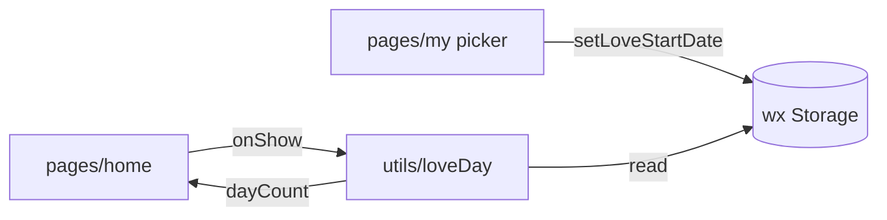

> **仓库现状**：模板分包、`mock/`、`api/`、模板用 `static/`、未使用的 `components` 等已从代码库移除；以下正文为改造前背景与方案说明，便于对照。

# 恋爱日记（MVP：恋爱天数）改造计划

## 目标与范围

- 小程序名称展示为 **「恋爱日记」**（导航栏标题与 Tab 文案；微信后台小程序名称需在公众平台单独修改）。
- **核心功能**：用户选择「恋爱开始日期」后，首页展示从该日起算的天数（建议采用 **起算日当天为第 1 天** 的 inclusive 规则，与国内常见「在一起第 N 天」一致）。
- **数据**：仅用 `wx.setStorageSync` / `getStorageSync` 存一个字段（如 `love_start_date`，格式 `YYYY-MM-DD`），无后端、无登录。

## 现状要点

- 入口与 Tab 配置在 `[app.json](app.json)`：当前 `pages` 含 `home` / `message` / `my`，`tabBar.custom` + `[custom-tab-bar/](custom-tab-bar/)` 使用 TDesign `t-tab-bar`。
- 首页 `[pages/home/](pages/home/)` 为推荐流 + Mock 接口（`[pages/home/index.js](pages/home/index.js)` + `[~/api/request](api/request)`）。
- `[app.js](app.js)` 在 `onLaunch` 里无条件拉未读数、连 WebSocket（依赖 `[mock/chat](mock/chat.js)`），与恋爱日记无关且 `isMock: false` 时易出问题。
- `[config.js](config.js)` 当前 `isMock: true`。

## 实现方案

### 1. 本地日期与天数字段

新增小工具模块（建议 `[utils/loveDay.js](utils/loveDay.js)`）：

- **读**：`getLoveStartDate()` / `getLoveDayCount()`。
- **写**：`setLoveStartDate('YYYY-MM-DD')`。
- **计算**：将开始日与「今天」都归一到本地 0 点，用日期差计算；开始日晚于今天可返回 `null` 或 0 并提示重新选择。
- **约定**：inclusive：`dayCount = floor((today - start) / 86400000) + 1`（同一天为 1）。

首页与设置页只调用该模块，避免重复逻辑。

### 2. 改造首页（恋爱天数主界面）

文件：`[pages/home/index.wxml](pages/home/index.wxml)`、`[pages/home/index.less](pages/home/index.less)`、`[pages/home/index.js](pages/home/index.js)`、`[pages/home/index.json](pages/home/index.json)`。

- 去掉 `nav`、轮播、`card`、`t-tabs`、下拉刷新、`goRelease` 等与模板业务相关的结构和请求。
- UI 建议：**未设置日期**时展示简短说明 + 按钮「去设置」`wx.switchTab` 到 `pages/my/index`；**已设置**时大字展示天数 + 副文案（如开始日期）。
- 在 `onShow` 中刷新天数（从设置页返回后自动更新）。
- 将 `navigationStyle` 改为默认导航栏（删除 custom nav），在 `[pages/home/index.json](pages/home/index.json)` 设置 `navigationBarTitleText`: `恋爱日记`，减少自定义导航适配成本。

### 3. 改造「我的」为设置页

文件：`[pages/my/index.*](pages/my/)`（保留路径以兼容 TabBar，避免改路由）。

- 去掉登录、网格、客服列表、`request` 等；保留 TDesign 即可：`t-cell` + `picker`（`mode="date"`）或 `t-date-time-picker`（与现有依赖一致即可）。
- 展示当前已保存的开始日期；用户选日期后写入 Storage，并 `toast` 成功（可继续用现有 `[behaviors/useToast](behaviors/useToast.js)`）。
- `navigationBarTitleText` 改为「设置」或「恋爱设置」；若保留 `navigationStyle: custom`，则把 `[nav](components/nav)` 的 title 改成对应文案；更简方案与首页一致改为默认导航栏。

### 4. TabBar 与路由收敛

- `[app.json](app.json)`：`tabBar.list` 只保留两项——首页（`pages/home/index`）、设置（`pages/my/index`）；**移除「消息」**。
- `pages` 数组：保留与 Tab 一致的两项为主包页面即可；**移除** `pages/message/index`（若工程内无 `switchTab`/`reLaunch` 到该页，可安全删除；若有引用需一并删掉）。
- `[custom-tab-bar/index.wxml](custom-tab-bar/index.wxml)` / `[index.js](custom-tab-bar/index.js)`：只保留两个 `t-tab-bar-item`（如「日记」「设置」）；去掉 `badge` 与 `unreadNum` 相关逻辑。
- 全局 `[app.json` window](app.json) 中 `navigationBarTitleText` 可改为 `恋爱日记` 作为默认标题。

### 5. 启动逻辑与 Mock

- `[app.js](app.js)`：删除或加开关（建议放在 `[config.js](config.js)` 如 `enableLegacyChat: false`）包裹 `connect()`、`getUnreadNum()` 及对 `eventBus` 未读消息的依赖，避免无聊天模块时仍初始化 WebSocket。
- `[config.js](config.js)`：MVP 可将 `isMock` 设为 `false`，避免加载 `[mock/index](mock/index.js)` 里与首页无关的接口拦截（若仍有页面依赖 Mock，再按需保留；改造后首页/设置不依赖 Mock）。

### 6. 可选清理（不阻塞上线）

- `subpackages`（登录、聊天、发布等）可暂留以减小一次性改动；后续再删可减包体。
- `[project.config.json](project.config.json)` 里小程序显示名称若存在字段可改为「恋爱日记」（依你当前工具版本字段为准）。

## 数据流（MVP）

## 验收清单

- 首次打开：首页提示设置，进入「我的」选日期后返回，首页显示正确天数。
- 跨天：次日打开或从后台回到前台，天数递增（依赖 `onShow` 刷新）。
- Tab 仅两项，切换正常；无消息 Tab、无启动报错。

